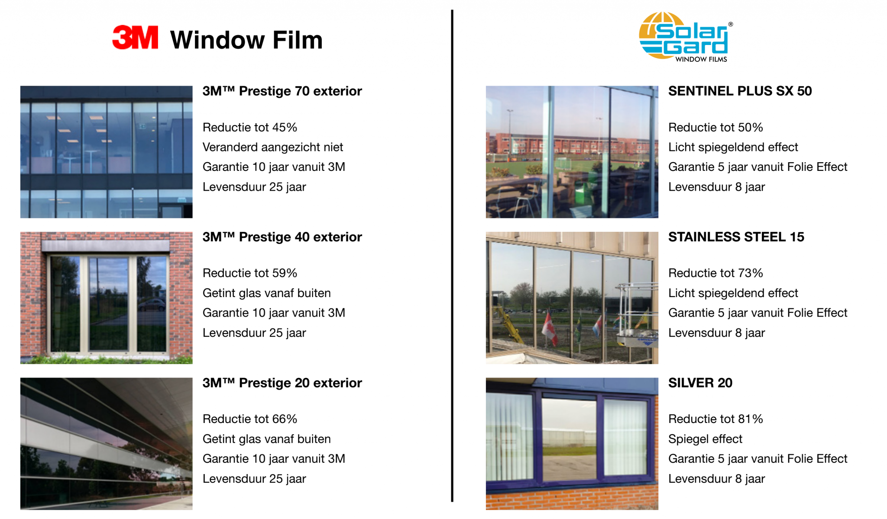

# Sun-Foil Sunscreens

**Foil #1:** [Multi-Metal XH 63 PS HC](https://suncontrol.nl/product/multi-metal-xh-63-ps-hc/)

* Cheapest of 40 eur pm2 (ex. VAT, installation, etc.)
* Installation on the inside of the window (inside the house)
* Because it contains metal, it affects phone/Wi-Fi signal reception and is susceptible to corrosion

**Foil #2:** [3M™ Sun Control Window Films, Prestige Series](https://www.3mnederland.nl/3M/nl\_NL/p/d/b5005059011/)

* Most expensive from 128-195 eur pm2 (ex. VAT, installation etc.)
* Installed on the outside
* Contains no metal, so no problems with phone/Wi-Fi signal or corrosion
* Long service life - 20 years
* Long warranty - 10 years
* You can read more below

**Foil #3:** [Sentinel Plus SX 50 OSW](https://www.solargard.com/in/product/sentinel-plus/)

* Reasonably priced from 140 eur pm2 (ex. VAT, installation etc.)
* Installed on the outside
* Because it contains metal, it affects the reception of telephone/Wi-Fi signals and is susceptible to corrosion
* Medium service life - 8 - 12 years
* Average warranty - 5 years

What suppliers have told me about 3M:

> The most commonly used solar control foil in homes is the 3M Prestige foil for mounting on the outside.
>
> This foil has a low glare and filters the sunlight in an intelligent way so that more heat is retained in the summer than in the winter.
>
> An additional advantage is that no metal particles have been processed in the foil, so that no corrosion can occur at the cut edges.
>
> 1. The foil is applied to the outside of the windows, this is very important, because this really keeps the heat outside. As a result, the chance of thermal glass breakage is virtually nil. Foils that are applied to the inside work less well and have a greater risk of thermal glass breakage.
> 2. 3M gives a unique warranty on the film and on thermal glass breakage.
> 3. You opt for top quality. The 3M Prestige 70 Exterior is almost completely transparent and blocks ± 50% of the total solar energy. The 40 Exterior is a shade darker and blocks ± 60% of the total solar energy.
> 4. You opt for convenience and comfort. We apply it professionally for you, in such a way that it is invisible.

